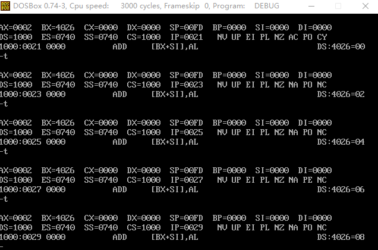
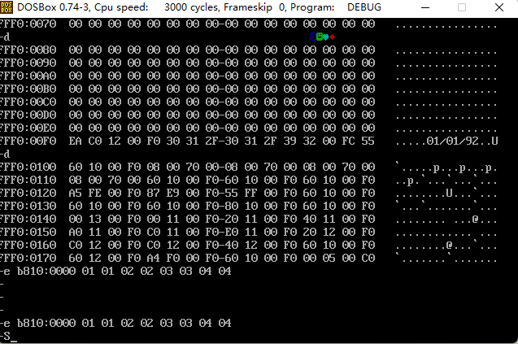

# asmProgram汇编程序

## 实验环境
- DOSBox
- 程序集
Debug、Link、......

DOSBOX自动挂载
```bash
[autoexec]
# Lines in this section will be run at startup.
# You can put your MOUNT lines here.
mount c d:\masm
set PATH=$PATH$;d:\masm

PS D:\masm\asmProgram> cat C:\Users\boge\AppData\Local\DOSBox\dosbox-0.74-3.conf
```

## 第二章
使用DOS-Debug

https://montcs.bloomu.edu/Information/LowLevel/DOS-Debug.html

1. 写入程序，观察寄存器



2. 计算2的8次方

```assembly
mov ax,1
add ax,ax
jmp 2000:0003

# 写入
-a 2000:0
mov ax,1
add ax,ax
jmp 2000:0003

-r cs
2000
-r ip
0
```
3. 查看内存内容

PC主板ROM有生产日期，位置：fff00h-fffffh

`-d fff0:0`
尝试修改后失败，该地址位于`ROM地址空间`（C000-FFFFF）所以无法修改


4. 向B8100H填写数据



显示出了图案：该地址位于显存地址空间

## 第三章 寄存器（内存访问）
