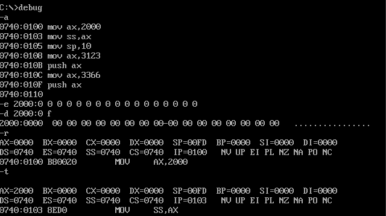

# asmProgram汇编程序

## 实验环境
- DOSBox
- 程序集
Debug、Link、......

DOSBOX自动挂载
```bash
[autoexec]
# Lines in this section will be run at startup.
# You can put your MOUNT lines here.
mount c d:\masm
set PATH=$PATH$;d:\masm

PS D:\masm\asmProgram> cat C:\Users\boge\AppData\Local\DOSBox\dosbox-0.74-3.conf
```

## 第二章
使用DOS-Debug

https://montcs.bloomu.edu/Information/LowLevel/DOS-Debug.html

1. 写入程序，观察寄存器


2. 计算2的8次方

```assembly
mov ax,1
add ax,ax
jmp 2000:0003

# 写入
-a 2000:0
mov ax,1
add ax,ax
jmp 2000:0003

-r cs
2000
-r ip
0
```
3. 查看内存内容

PC主板ROM有生产日期，位置：fff00h-fffffh

`-d fff0:0`
尝试修改后失败，该地址位于`ROM地址空间`（C000-FFFFF）所以无法修改


4. 向B8100H填写数据


显示出了图案：该地址位于显存地址空间

## 第三章 寄存器（内存访问）
> 8086CPU不支持将数据直接送入段寄存器

POP之后，对应位置的数据依然存在，只是不在栈中了。

如何保证栈顶不超界？（8086没有这样的设计来保证栈顶不超界。不管是POP还是PUSH，超出栈空间后再进行PUSH操作会覆盖数据。）

> 一段内存，既可以是代码的存储空间，又是数据的存储空间，还可以是栈空间，也可以什么都不是，关键在于CPU中寄存器的设置，即CS、IP、SS、SP、DS的指向。

### 实验2 用机器指令和汇编指令编程（Todo）

在E、A、U命令中使用段寄存器

关键点：`Debug的T命令在执行修改寄存器SS的指令时，下一条指令也紧接着被执行`

**下面这段汇编的执行结果**

```assembly
mov ax,2000
mov ss,ax
mov sp,10
mov ax,3123
push ax
mov ax,3366
push ax
```




<font color="red">**为什么这里的数据会被修改？**</font>

## 第四章

开始写程序...

程序中与结束相关的概念

| 目的                   | 相关指令             | 指令性质 | 指令执行者 |
| ---------------------- | -------------------- | -------- | ---------- |
| 通知编译器第一个段结束 | 段名 ends            | 伪指令   | 编译器执行 |
| 通知编译器程序结束     | end                  | 伪指令   | 编译器执行 |
| 程序返回               | mov ax,4c00h int 21h | 汇编指令 | CPU执行    |

汇编程序从写出到执行的过程：

编程（Edit）-->1.asm-->编译（masm）-->1.obj-->连接（link）-->1.exe-->加载（command）-->内存中的程序-->运行（CPU）

### Dos系统中exe文件程序加载的过程


使用下面的例子进行说明：

```assembly
assume cs:codesg

codesg segment
    mov ax,0123h
    mov bx,0456h
    add ax,bx
    add ax,ax

    mov ax,4c00h
    int 21h

codesg ends

end
```

debug 1.exe

1. 查看DS寄存器&&查看CS、IP寄存器


2. 查看汇编指令


3. 跟踪执行

P命令

> Proceed:  P  [=address]  [number]
>
> Proceed acts exactly the same as Debug's T (Trace) command for most types of instructions... EXCEPT: Proceed will immediately execute ALL the instructions (rather than stepping  through each one) inside any Subroutine CALL, a LOOP, a REPeated string  instruction or any software INTerrupts. This means that you do not have  to single-step through any of the code contained in a Subroutine or INT  call if you use the Proceed (P) command.  This means Proceed will be the command you use most often to debug programs, and Trace  will only be used to step into a Subroutine or possibly check the logic  of the first few iterations of a LOOP or REP instruction.

P指令在此处可以执行INT调用后的所有指令

### 实验3


